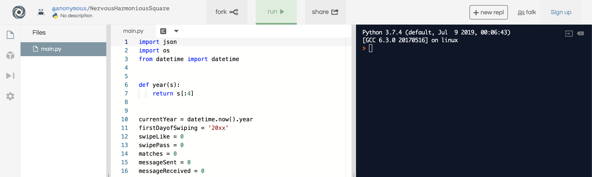
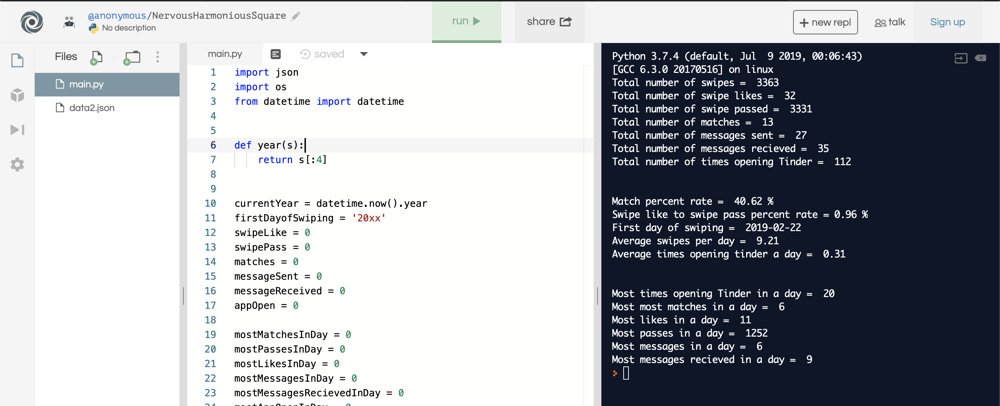

# TinderData
A small python script I made for the Reddit community r/TinderData that allows users to upload their Tinder Data to see how many swipes, passes, matches, etc. that they have.

How to view your data:
1. Download your data from https://account.gotinder.com/login?from=%2Fdata
2. Open this link https://repl.it/repls/NervousHarmoniousSquare
3. Click the fork button 

4.Click the 3 vertical grey dots and upload your file "data.json"

5. Click run and see your data!

